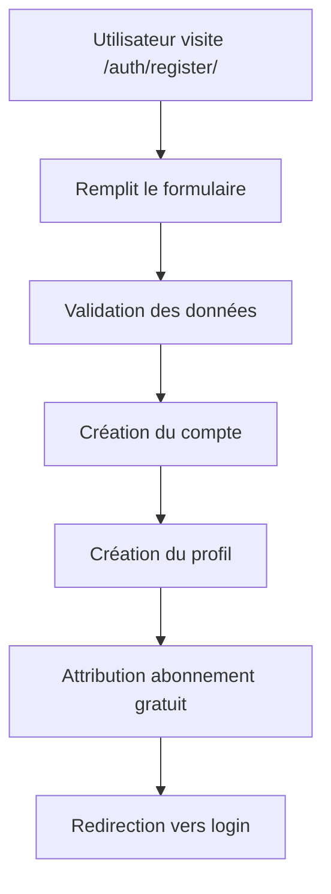
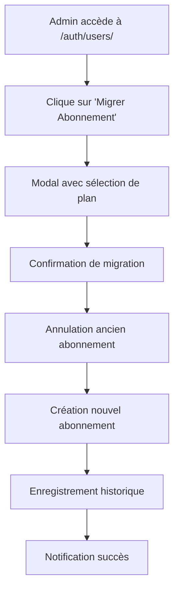
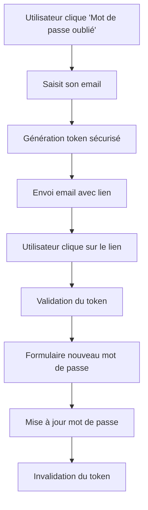
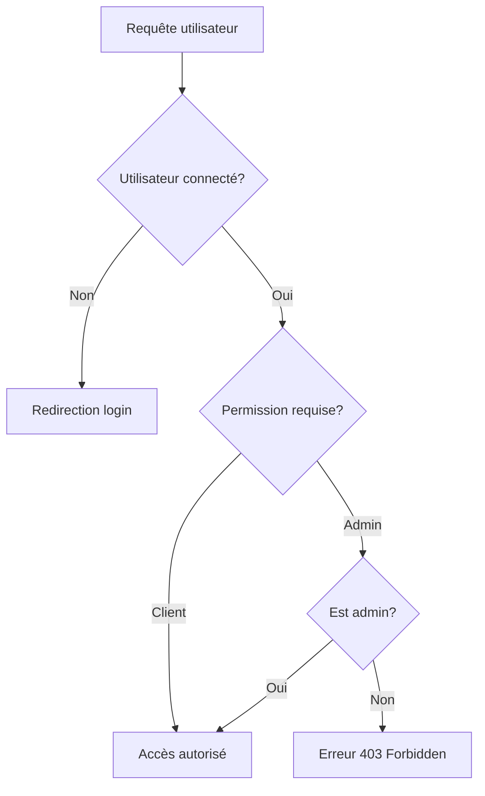

# 🚀 SaaS Subscription Management Platform

Une plateforme complète de gestion d'abonnements SaaS développée avec Django, offrant un système robuste de gestion des utilisateurs, des abonnements et des permissions.

## 📋 Table des matières

- [Fonctionnalités principales](#-fonctionnalités-principales)
- [Architecture du projet](#-architecture-du-projet)
- [Installation et configuration](#-installation-et-configuration)
- [Gestion des utilisateurs](#-gestion-des-utilisateurs)
- [Système d'abonnements](#-système-dabonnements)
- [Gestion des permissions](#-gestion-des-permissions)
- [Réinitialisation de mot de passe](#-réinitialisation-de-mot-de-passe)
- [Workflows fonctionnels](#-workflows-fonctionnels)
- [Structure des fichiers](#-structure-des-fichiers)
- [API et endpoints](#-api-et-endpoints)

## 🎯 Fonctionnalités principales

### ✅ Authentification et gestion des utilisateurs
- Système d'authentification personnalisé basé sur l'email
- Profils utilisateurs avec informations étendues
- Gestion des types d'utilisateurs (Admin/Client)
- Réinitialisation de mot de passe par email
- Interface d'administration pour la gestion des utilisateurs

### ✅ Système d'abonnements complet
- Plans d'abonnement flexibles (Gratuit, Basic, Premium, Enterprise)
- Cycles de facturation multiples (Mensuel, Annuel, Lifetime)
- Migration d'abonnements (Upgrade/Downgrade)
- Historique des abonnements
- Limites par plan (utilisateurs, projets, stockage)

### ✅ Gestion des permissions
- Contrôle d'accès basé sur les rôles
- Permissions granulaires par fonctionnalité
- Middleware de sécurité
- Protection CSRF

### ✅ Interface utilisateur moderne
- Design responsive avec Tailwind CSS
- Animations et transitions fluides
- Page d'erreur 404 animée
- Modales interactives
- Feedback utilisateur en temps réel

## 🏗️ Architecture du projet

```
Saas subscription/
├── apps/
│   ├── auth/                 # Gestion des utilisateurs et authentification
│   ├── subscription/         # Système d'abonnements
│   └── dashboard/           # Tableau de bord
├── config/                  # Configuration Django
├── templates/              # Templates HTML
├── static/                 # Fichiers statiques
└── requirements.txt        # Dépendances Python
```

## 🚀 Installation et configuration

### Prérequis
- Python 3.8+
- Django 4.2+
- Base de données SQLite (par défaut)

### Installation

```bash
# Cloner le projet
git clone <repository-url>
cd "Saas subscription"

# Créer un environnement virtuel
python -m venv venv
source venv/bin/activate  # Linux/Mac
# ou
venv\Scripts\activate     # Windows

# Installer les dépendances
pip install -r requirements.txt

# Appliquer les migrations
python manage.py migrate

# Créer un superutilisateur
python manage.py createsuperuser

# Lancer le serveur
python manage.py runserver
```

### Configuration email (pour la réinitialisation de mot de passe)

Dans `config/settings/dev.py`, configurez les paramètres email :

```python
EMAIL_BACKEND = 'django.core.mail.backends.smtp.EmailBackend'
EMAIL_HOST = 'smtp.gmail.com'
EMAIL_PORT = 587
EMAIL_USE_TLS = True
EMAIL_HOST_USER = 'votre-email@gmail.com'
EMAIL_HOST_PASSWORD = 'votre-mot-de-passe-app'
DEFAULT_FROM_EMAIL = 'votre-email@gmail.com'
```

## 👥 Gestion des utilisateurs

### Modèles utilisateur

**Fichier principal :** `apps/auth/models.py`

#### CustomUser
- **Champs principaux :** email (unique), first_name, last_name, user_type
- **Types d'utilisateur :** admin, client
- **Fonctionnalités :** Authentification par email, gestion des permissions

#### UserProfile
- **Relation :** OneToOne avec CustomUser
- **Champs :** bio, location, birth_date, website, préférences de notification

#### PasswordResetToken
- **Fonctionnalité :** Gestion sécurisée des tokens de réinitialisation
- **Expiration :** 24 heures
- **Sécurité :** Token unique, usage unique

### Vues et fonctionnalités

**Fichier principal :** `apps/auth/views.py`

| Vue | URL | Description | Permissions |
|-----|-----|-------------|-------------|
| `CustomLoginView` | `/auth/login/` | Connexion utilisateur | Public |
| `RegisterView` | `/auth/register/` | Inscription | Public |
| `ProfileView` | `/auth/profile/` | Profil utilisateur | Connecté |
| `UserListView` | `/auth/users/` | Liste des utilisateurs | Admin |
| `password_reset_request` | `/auth/password-reset/` | Demande de réinitialisation | Public |
| `password_reset_confirm` | `/auth/password-reset-confirm/<token>/` | Confirmation réinitialisation | Public |

## 💳 Système d'abonnements

### Modèles d'abonnement

**Fichier principal :** `apps/subscription/models.py`

#### Plan
- **Types :** free, basic, premium, enterprise
- **Cycles :** monthly, yearly, lifetime
- **Limites :** max_users, max_projects, storage_limit_gb
- **Fonctionnalités :** API access, priority support, advanced analytics

#### Subscription
- **Relation :** ForeignKey vers User et Plan
- **États :** active, cancelled, expired
- **Gestion :** Dates de début/fin, facturation automatique

#### SubscriptionHistory
- **Traçabilité :** Historique complet des changements
- **Actions :** created, upgraded, downgraded, cancelled

### Migration d'abonnements

**Fichiers concernés :**
- `apps/auth/views.py` (vues `migrate_user_to_paid`, `migrate_user_to_free`)
- `templates/auth/user_list.html` (interface utilisateur)

#### Fonctionnalités de migration

1. **Migration vers payant** (`/auth/users/<id>/migrate-to-paid/`)
   - Sélection du plan cible
   - Annulation de l'abonnement gratuit
   - Création du nouvel abonnement
   - Enregistrement dans l'historique

2. **Rétrogradation vers gratuit** (`/auth/users/<id>/migrate-to-free/`)
   - Confirmation avec avertissement
   - Annulation de l'abonnement payant
   - Création d'un abonnement gratuit
   - Notification de la perte de fonctionnalités

## 🔐 Gestion des permissions

### Système de permissions

**Fichier principal :** `apps/auth/permissions.py`

#### Décorateurs de permission
- `@admin_required` : Accès réservé aux administrateurs
- `@login_required` : Accès pour utilisateurs connectés

#### Mixins pour les vues basées sur les classes
- `AdminRequiredMixin` : Contrôle d'accès pour les vues CBV
- `LoginRequiredMixin` : Authentification requise

### Contrôle d'accès par fonctionnalité

| Fonctionnalité | Admin | Client |
|----------------|-------|--------|
| Gestion des utilisateurs | ✅ | ❌ |
| Migration d'abonnements | ✅ | ❌ |
| Profil personnel | ✅ | ✅ |
| Dashboard | ✅ | ✅ |
| Réinitialisation mot de passe | ✅ | ✅ |

## 🔑 Réinitialisation de mot de passe

### Workflow de réinitialisation

1. **Demande de réinitialisation** (`/auth/password-reset/`)
   - Saisie de l'email
   - Validation de l'existence du compte
   - Génération d'un token sécurisé
   - Envoi d'email avec lien de réinitialisation

2. **Confirmation et nouveau mot de passe** (`/auth/password-reset-confirm/<token>/`)
   - Validation du token (existence, expiration, usage)
   - Formulaire de nouveau mot de passe
   - Validation des critères de sécurité
   - Mise à jour du mot de passe
   - Invalidation du token

### Sécurité
- **Tokens uniques** : Générés avec `secrets.token_urlsafe(32)`
- **Expiration** : 24 heures maximum
- **Usage unique** : Token invalidé après utilisation
- **Validation côté serveur** : Vérification de tous les critères

### Templates
- `templates/auth/password_reset_request.html` : Formulaire de demande
- `templates/auth/password_reset_confirm.html` : Formulaire de confirmation

## 🔄 Workflows fonctionnels

### 1. Inscription et activation d'un utilisateur



### 2. Migration d'abonnement (Admin)



### 3. Réinitialisation de mot de passe



### 4. Contrôle d'accès et permissions



## 📁 Structure des fichiers

### Applications principales

#### `apps/auth/` - Authentification et utilisateurs
```
auth/
├── models.py              # CustomUser, UserProfile, PasswordResetToken
├── views.py               # Vues d'authentification et gestion utilisateurs
├── forms.py               # Formulaires personnalisés
├── permissions.py         # Décorateurs et mixins de permissions
├── urls.py               # URLs de l'app auth
└── migrations/           # Migrations de base de données
```

#### `apps/subscription/` - Gestion des abonnements
```
subscription/
├── models.py              # Plan, Subscription, SubscriptionHistory
├── views.py               # Vues de gestion des abonnements
├── urls.py               # URLs de l'app subscription
└── migrations/           # Migrations de base de données
```

#### `apps/dashboard/` - Tableau de bord
```
dashboard/
├── views.py               # Vues du dashboard
├── urls.py               # URLs du dashboard
└── templates/dashboard/   # Templates du dashboard
```

### Templates
```
templates/
├── base.html              # Template de base
├── 404.html              # Page d'erreur 404 animée
├── auth/
│   ├── login.html         # Page de connexion
│   ├── register.html      # Page d'inscription
│   ├── profile.html       # Profil utilisateur
│   ├── user_list.html     # Liste des utilisateurs (admin)
│   ├── password_reset_request.html    # Demande réinitialisation
│   └── password_reset_confirm.html    # Confirmation réinitialisation
└── dashboard/
    └── dashboard.html     # Tableau de bord principal
```

### Configuration
```
config/
├── settings/
│   ├── base.py           # Paramètres de base
│   ├── dev.py            # Paramètres de développement
│   └── prod.py           # Paramètres de production
├── urls.py               # URLs principales + gestionnaire 404
└── wsgi.py               # Configuration WSGI
```

## 🔌 API et endpoints

### Endpoints d'authentification

| Méthode | URL | Description | Permissions |
|---------|-----|-------------|-------------|
| GET/POST | `/auth/login/` | Connexion | Public |
| GET/POST | `/auth/register/` | Inscription | Public |
| POST | `/auth/logout/` | Déconnexion | Connecté |
| GET | `/auth/profile/` | Profil utilisateur | Connecté |
| GET/POST | `/auth/profile/edit/` | Modification profil | Connecté |

### Endpoints d'administration

| Méthode | URL | Description | Permissions |
|---------|-----|-------------|-------------|
| GET | `/auth/users/` | Liste des utilisateurs | Admin |
| POST | `/auth/users/<id>/toggle-status/` | Activer/Désactiver utilisateur | Admin |
| POST | `/auth/users/<id>/change-type/` | Changer type utilisateur | Admin |
| GET/POST | `/auth/users/<id>/migrate-to-paid/` | Migration vers payant | Admin |
| GET/POST | `/auth/users/<id>/migrate-to-free/` | Migration vers gratuit | Admin |

### Endpoints de réinitialisation

| Méthode | URL | Description | Permissions |
|---------|-----|-------------|-------------|
| GET/POST | `/auth/password-reset/` | Demande réinitialisation | Public |
| GET/POST | `/auth/password-reset-confirm/<token>/` | Confirmation réinitialisation | Public |

### API JSON

| Méthode | URL | Description | Réponse |
|---------|-----|-------------|----------|
| GET | `/auth/api/user-info/` | Informations utilisateur | JSON |
| GET | `/auth/users/<id>/migrate-to-paid/` | Plans disponibles | JSON |
| POST | `/auth/users/<id>/migrate-to-paid/` | Résultat migration | JSON |
| GET | `/auth/users/<id>/migrate-to-free/` | Info abonnement actuel | JSON |
| POST | `/auth/users/<id>/migrate-to-free/` | Résultat rétrogradation | JSON |

## 🛡️ Sécurité

### Mesures de sécurité implémentées

1. **Protection CSRF** : Tous les formulaires incluent ``
2. **Validation des permissions** : Décorateurs et mixins sur toutes les vues sensibles
3. **Tokens sécurisés** : Utilisation de `secrets.token_urlsafe()` pour les tokens
4. **Expiration des tokens** : Durée de vie limitée (24h)
5. **Validation des données** : Formulaires Django avec validation côté serveur
6. **Hachage des mots de passe** : Utilisation du système Django (PBKDF2)
7. **Protection contre l'énumération** : Messages génériques pour la réinitialisation

### Bonnes pratiques

- ✅ Séparation des environnements (dev/prod)
- ✅ Variables d'environnement pour les secrets
- ✅ Validation des entrées utilisateur
- ✅ Logging des actions sensibles
- ✅ Gestion des erreurs appropriée
- ✅ Interface utilisateur intuitive

## 🚀 Déploiement

### Variables d'environnement requises

```bash
# Base de données
DATABASE_URL=sqlite:///db.sqlite3

# Email
EMAIL_HOST=smtp.gmail.com
EMAIL_HOST_USER=votre-email@gmail.com
EMAIL_HOST_PASSWORD=votre-mot-de-passe-app

# Sécurité
SECRET_KEY=votre-clé-secrète-django
DEBUG=False
ALLOWED_HOSTS=votre-domaine.com
```

### Commandes de déploiement

```bash
# Collecte des fichiers statiques
python manage.py collectstatic --noinput

# Application des migrations
python manage.py migrate

# Création des données de base
python manage.py loaddata initial_data.json
```

## 📈 Évolutions futures

### Fonctionnalités prévues
- [ ] Paiements en ligne (Stripe/PayPal)
- [ ] Notifications en temps réel
- [ ] API REST complète
- [ ] Tableau de bord analytique
- [ ] Système de facturation automatique
- [ ] Support multi-tenant
- [ ] Application mobile

### Améliorations techniques
- [ ] Tests unitaires et d'intégration
- [ ] Documentation API (Swagger)
- [ ] Monitoring et logging avancés
- [ ] Cache Redis
- [ ] Optimisation des performances
- [ ] Sécurité renforcée (2FA)

---

## 📞 Support

Pour toute question ou problème :
- 📧 Email : support@votre-domaine.com
- 📖 Documentation : [Wiki du projet]
- 🐛 Bugs : [Issues GitHub]

---

**Développé avec ❤️ en Django**
